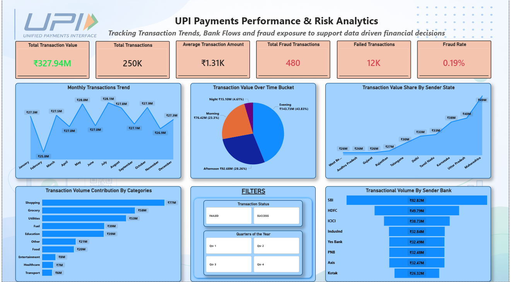

 # 💳 UPI Transaction Fraud Detection Analytics – India

<div align="center">


### **Business Intelligence | Fraud Analytics | Risk Monitoring | Power BI Dashboard**

**Developed by**

# **Ayushi Gupta**

### **Business Analyst**
**Excel | SQL | Power BI | Statistics | Python | EDA**

</div>

---

# 📌 Project Overview

The rapid growth of India's **Unified Payments Interface (UPI)** has transformed the digital payment ecosystem by enabling fast, secure, and seamless financial transactions. However, the increasing transaction volume has also introduced greater exposure to fraudulent activities.

This project presents an end-to-end **Business Intelligence and Fraud Analytics Dashboard** built using **Power BI** to analyze **250,000 UPI transactions**. The dashboard enables stakeholders to monitor transaction performance, identify fraud patterns, evaluate banking trends, and support data-driven decision-making.

The project demonstrates how data analytics can be leveraged to strengthen fraud monitoring frameworks, improve operational efficiency, and reduce financial risks.

---

# 🎯 Business Objectives

- Analyze overall UPI transaction performance.
- Monitor fraud occurrence across the payment ecosystem.
- Identify high-risk transaction patterns.
- Evaluate transaction trends across states and banks.
- Analyze transaction value distribution over different time periods.
- Provide actionable business insights for fraud prevention.
- Support data-driven financial decision-making.

---

# 📊 Dashboard Highlights

The interactive Power BI dashboard includes:

- 📈 Overall Transaction Performance
- 💰 Total Transaction Value
- 🔢 Total Transactions
- 💵 Average Transaction Amount
- 🚨 Fraud Transactions & Fraud Rate
- ❌ Failed Transactions
- 📅 Monthly Transaction Trend
- 🕒 Transaction Value by Time Bucket
- 🗺️ State-wise Transaction Analysis
- 🛒 Category-wise Transaction Contribution
- 🏦 Sender Bank Performance
- 🎛 Interactive Filters

---

# 🛠️ Tech Stack

| Tool | Purpose |
|------|----------|
| **Power BI** | Interactive Dashboard & Visualization |
| **SQL** | Data Querying & Aggregation |
| **Python** | Data Preparation & EDA |
| **Excel / Power Query** | Data Cleaning & Transformation |
| **Statistics** | Business Analysis & Trend Identification |

---

# 📂 Project Structure

```
UPI-Transaction-Fraud-Detection-Analytics/
│
├── 📁 power_bi_analysis
│   └── upi_fraud_detection_analysis.pbix
│
├── 📁 documentation
│   ├── upi_fraud_detection_project_report_business_insights.pdf
│   └── upi_fraud_detection_project_problem_statement.pdf
│
├── 📁 dashboard_export
│   ├── dashboard.pdf
│   └── dashboard.png
│
├── 📁 dataset
│   ├── data_table.pdf
│   └── upi_transactions_2024.zip
│
└── README.md
```

---

# 📁 Folder Description

## 📊 power_bi_analysis

Contains the complete **Power BI (.pbix)** project file, including:

- Data Model
- DAX Measures
- Dashboard Design
- Interactive Visualizations
- Business KPIs

---

## 📄 documentation

Contains project documentation including:

- **Project Report**
- Business Insights
- Recommendations
- Problem Statement

---

## 🖼️ dashboard_export

Contains exported dashboard files for quick viewing.

- Dashboard Image (.png)
- Dashboard PDF (.pdf)

---

## 🗂️ dataset

Contains project datasets and supporting files.

- Transaction Dataset (.zip)
- Data Dictionary (.pdf)

---

# 📈 Key Business KPIs

- Total Transaction Value
- Total Transactions
- Average Transaction Amount
- Fraud Transactions
- Fraud Rate
- Failed Transactions

---

# 🔍 Key Insights

- Processed **250K+ UPI Transactions**
- Transaction value exceeded **₹327 Million**
- Fraud Rate remained at **0.19%**
- Shopping contributed the highest transaction volume.
- Maharashtra recorded the highest transaction value.
- SBI processed the largest sender transaction volume.
- Evening transactions accounted for the largest share of transaction value.

---

# 💡 Business Recommendations

- Implement real-time fraud monitoring.
- Develop AI-based anomaly detection models.
- Monitor high-value transactions continuously.
- Strengthen fraud controls for high-volume banks.
- Enhance customer authentication mechanisms.
- Improve operational efficiency to reduce failed transactions.
- Build predictive fraud scoring models.

---

# 🚀 Future Enhancements

- Machine Learning Fraud Detection
- Real-Time Fraud Alerts
- Fraud Heat Maps
- Device & Network Risk Analysis
- Transaction Type Fraud Analysis
- Predictive Risk Scoring
- Customer Risk Segmentation

---

# 📷 Dashboard Preview



---

# 📚 Learning Outcomes

This project demonstrates practical experience in:

- Business Intelligence
- Fraud Analytics
- Financial Risk Analysis
- Data Visualization
- Exploratory Data Analysis (EDA)
- Dashboard Design
- KPI Development
- Business Storytelling
- Data-Driven Decision Making

---

# 👩‍💼 About Me

## **Ayushi Gupta**

**Business Analyst**

**Skills**

- 📊 Power BI
- 🗄 SQL
- 🐍 Python
- 📈 Excel
- 📉 Statistics
- 🔍 Exploratory Data Analysis (EDA)

---

# 🤝 Connect With Me

**LinkedIn:** *https://www.linkedin.com/in/ayushigupta001*

**GitHub:** *https://github.com/Ayushi-Gupta16*

**Email:** *k.ayushigupta16@gmail.com*

---

<div align="center">

### ⭐ If you found this project helpful, consider giving it a Star!

**Thank you for visiting my project!**

</div>
